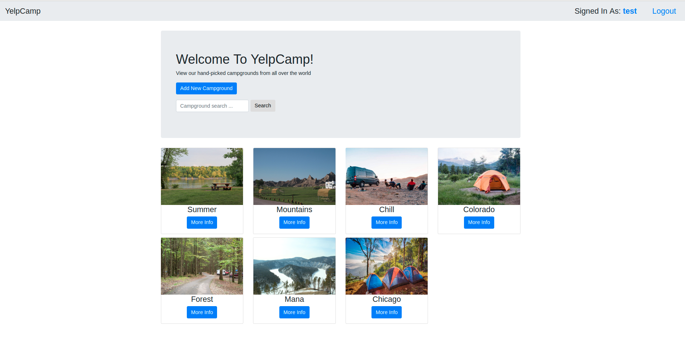
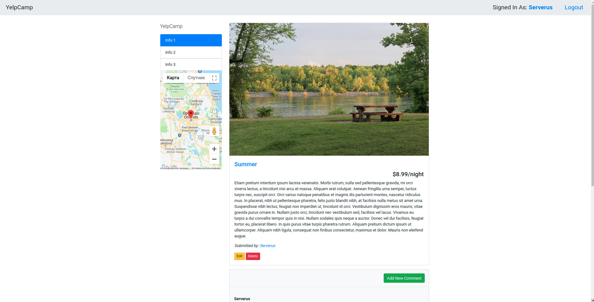
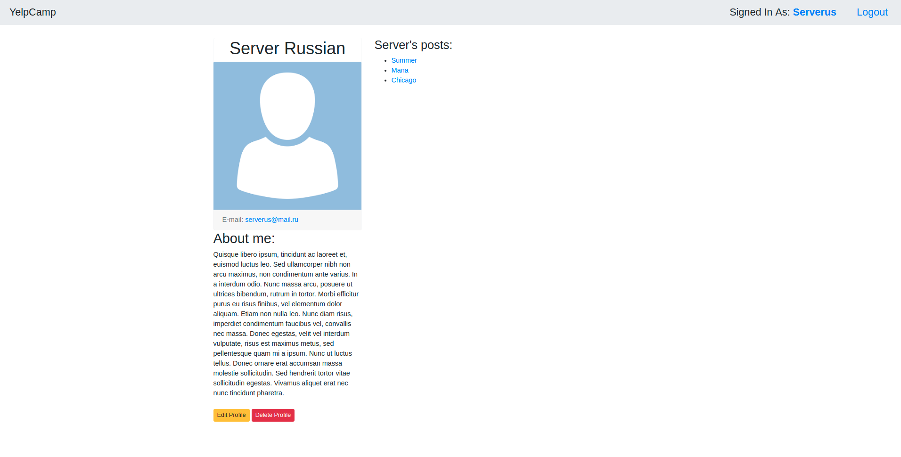

# YelpCamp
This is website which allows users to create campgrounds(posts), leave comments on other's campgrounds, edit and delete your campgrounds. It has a lot of other features such as: 
>Fuzzy serach through all campgrounds(posts)  
Google Maps API to determine campground location  
Authentication  
Authorization  
Admin role  
Upload images from your local storage and more ...  

# Features

### Main Page
Here you can:
* Login/Logout
* Add new Campground
* Serach through all Campgrounds
* View certain Campground
* View your Profile page

### Campground Page
Here you can:
* Leave a comment
* Edit/Delete Campground if you are owner
* Edit/Delete your comments

### Profile Page
Here you can:
* Edit/Delete your profile
* See all your posts

## Tech Stack & Technologies
* Node.js
* Exprass
* MongoDB
* Passport
* Cloudinary
* Multer
